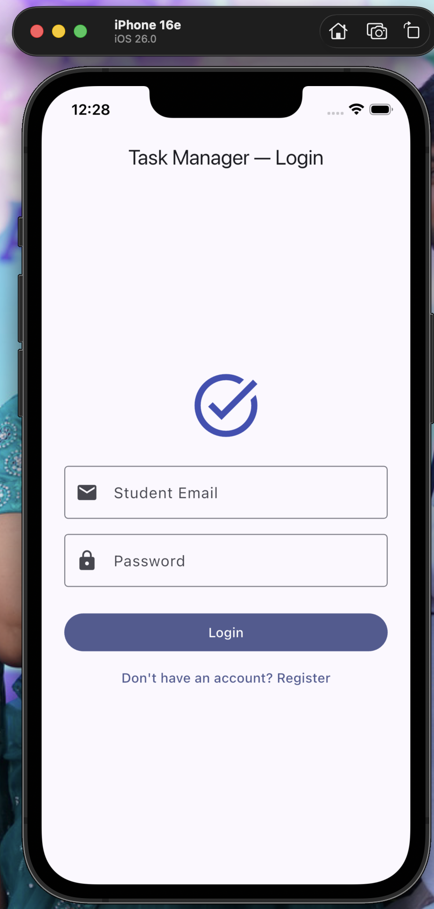
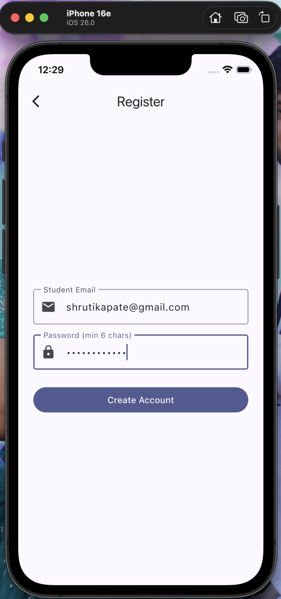
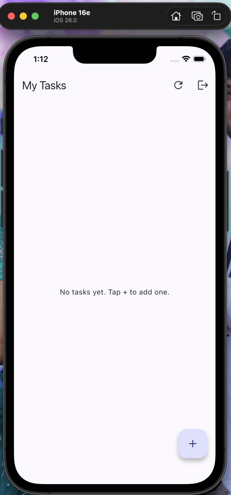
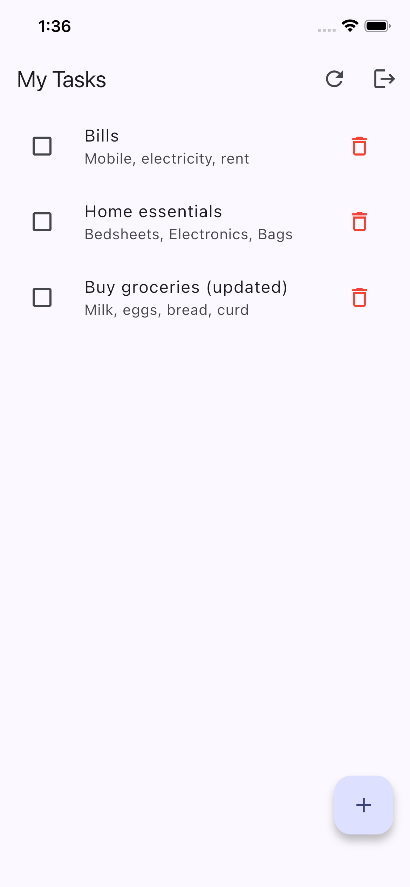
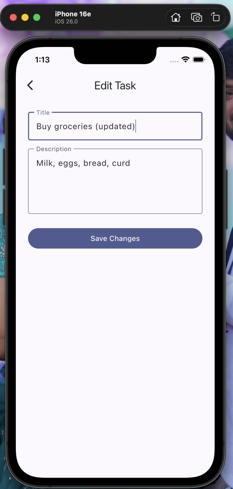
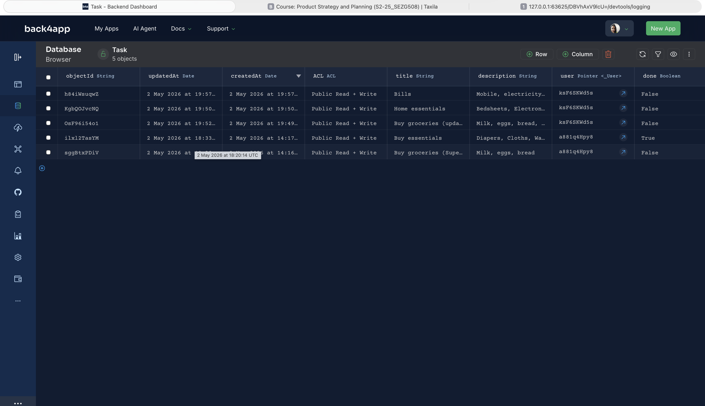

# Task Manager App

A Flutter-based Task Manager Application that uses **Back4App (Parse Server)** as a Backend-as-a-Service (BaaS). Users can register/login with their email, and create, read, update, and delete personal tasks stored in the cloud.

> Submission for **BITS Pilani WILP — Introduction to App Development (Assignment 2)**.

## Features

- **User Authentication** — Register and login with email and password
- **CRUD on Tasks** — Create, view, edit, mark done, swipe to delete
- **Cloud Storage** — All tasks live in Back4App's database; works across devices
- **Per-User Data** — Each user only sees their own tasks (Pointer relationship)
- **Persistent Sessions** — Stay logged in across app restarts
- **Server-side Session Validation** — Stale sessions are caught at startup
- **Secure Logout** — Invalidates session on the server

## Screenshots

| Login | Register | Empty Tasks |
|---|---|---|
|  |  |  |

| Task List | Edit Task | Back4App Database |
|---|---|---|
|  |  |  |

## Demo Video

📹 **[2-minute walkthrough on YouTube](https://youtu.be/YOUR_VIDEO_ID)**

The video shows the complete flow: register → login → create task → edit task → mark done → delete task → logout.

## Tech Stack

| Layer | Technology |
|---|---|
| Frontend | Flutter 3.41 (Dart) |
| Backend | Back4App (Parse Server) |
| Database | Back4App Cloud Database |
| Authentication | Parse `_User` class |
| State management | Flutter `StatefulWidget` + `FutureBuilder` |
| Version Control | Git + GitHub |

### Flutter packages

- `parse_server_sdk_flutter ^10.7.0` — official Parse SDK for Flutter

## Architecture

### Data Model

The `Task` class on Back4App has these columns:

| Column | Type | Description |
|---|---|---|
| `objectId` | String | Auto-generated unique ID |
| `title` | String | Task title |
| `description` | String | Task details |
| `user` | Pointer → `_User` | Owner of the task |
| `done` | Boolean | Whether the task is checked off |
| `createdAt` | Date | Auto-set on creation |
| `updatedAt` | Date | Auto-updated on save |

Class Level Permissions:
- **`_User` class** — Create: Public (signup), all others: Authenticated
- **`Task` class** — All CRUD operations: Authenticated only

## Project Structure
## Setup & Run

### Prerequisites

- Flutter SDK (3.0 or newer)
- Xcode (for iOS Simulator) or Android Studio (for Android Emulator)
- A free Back4App account

### 1. Clone and install

```bash
git clone https://github.com/ShrutiKapate/TaskManager-Flutter-Back4App.git
cd TaskManager-Flutter-Back4App
flutter pub get
```

### 2. Set up Back4App

1. Sign up at https://www.back4app.com
2. Create a new app called "TaskManager"
3. In the dashboard, go to **App Settings → Security & Keys** and copy:
   - Application ID
   - Client Key
4. In **Database Browser**, create a class named `Task` (Protected mode) with these columns:
   - `title` (String)
   - `description` (String)
   - `user` (Pointer → `_User`)
   - `done` (Boolean)
5. Set **Class Level Permissions** for `Task` so all CRUD operations require authentication

### 3. Configure your local secrets

```bash
cp lib/secrets.example.dart lib/secrets.dart
```

Open `lib/secrets.dart` and replace the placeholders with your actual Back4App keys:

```dart
const String kBack4AppAppId = 'YOUR_REAL_APP_ID';
const String kBack4AppClientKey = 'YOUR_REAL_CLIENT_KEY';
```

This file is gitignored so your keys never get committed.

### 4. Run the app

```bash
# iOS Simulator
open -a Simulator
flutter run

# Android Emulator (after starting one in Android Studio)
flutter run

# Web (Chrome)
flutter run -d chrome
```

## How It Works

### Authentication flow

1. User opens the app → `AuthGate` checks if a cached `ParseUser` exists
2. If yes — verify the cached session token against Back4App; if invalid, clear it
3. If valid session → go to Task List
4. If no session → go to Login screen

This server-side check prevents "ghost session" bugs where a token is locally cached but invalid on the server (which can happen after key rotation or server-side logout).

### CRUD on tasks

All task operations go through the Parse SDK:

```dart
// Create
final task = ParseObject('Task')
  ..set('title', 'Buy milk')
  ..set('user', currentUser.toPointer())
  ..set('done', false);
await task.save();

// Read (only my own tasks)
final query = QueryBuilder<ParseObject>(ParseObject('Task'))
  ..whereEqualTo('user', currentUser.toPointer())
  ..orderByDescending('createdAt');
final response = await query.query();

// Update
task.set('title', 'New title');
await task.save();

// Delete
await task.delete();
```

### Why Back4App?

- **Zero backend code** — auth, database, and REST API are pre-built
- **Generous free tier** — perfect for academic projects
- **Real REST API** — not a proprietary SDK lock-in; the Parse server is open source
- **Class Level Permissions** — declarative security without writing a single line of auth code

## What I Learned

- Flutter app structure with multiple screens and stateful navigation
- Integrating a third-party BaaS via SDK
- Cloud-based authentication and per-user data isolation via Pointer relationships
- Class Level Permissions for proper data security
- Handling stale-session edge cases that arise from key rotation or logout
- Keeping API keys out of version control using `.gitignore` and a template file

## Author

**Shruti Kapate** — BITS Pilani WILP, Introduction to App Development (Assignment 2)
